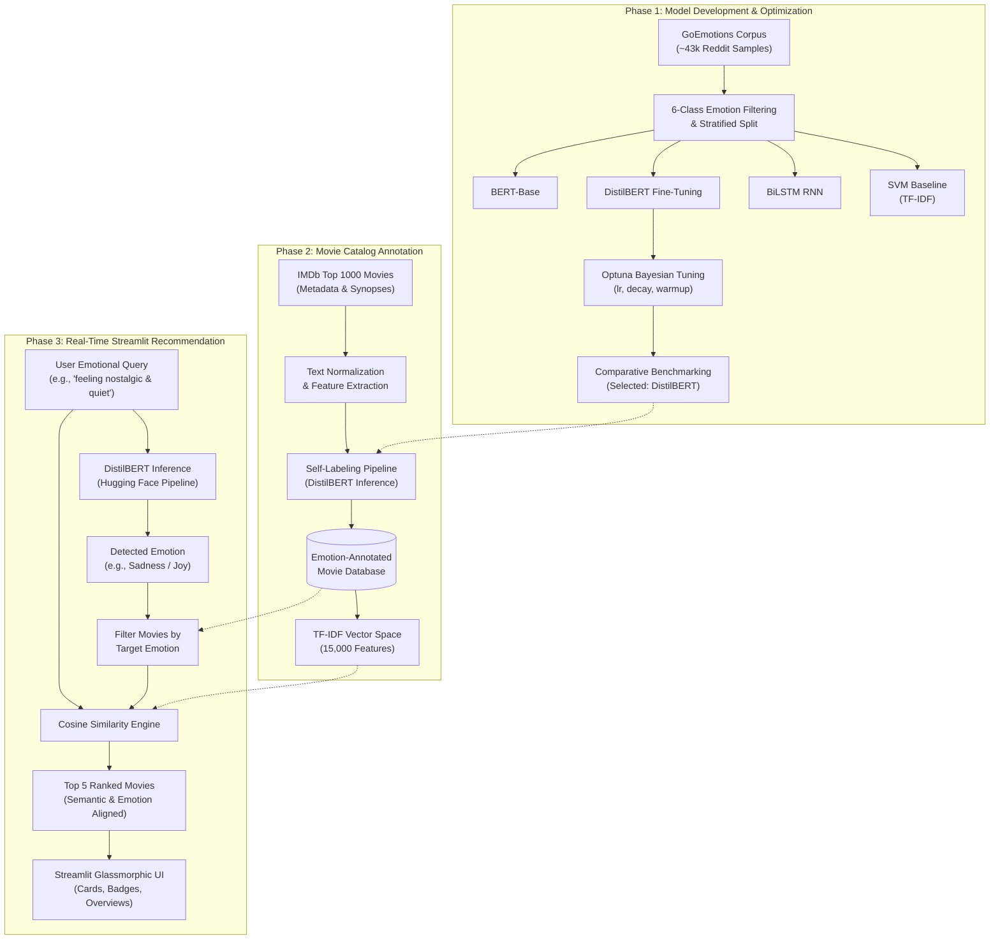

# Cinema.io — Personalized movie recommendation system powered by multi-emotion NLP


---
🌐 **Live Demo** — [View Live](https://finpronlp-cinemaio.streamlit.app/)
---

## Project Overview
Cinema.io is an end-to-end natural language processing and recommendation system developed as an academic Final Project at Bina Nusantara University under the academic supervision of the Course Lecturer. The platform analyzes free-form emotional statements and classifies them across six primary emotional categories using a fine-tuned DistilBERT transformer. It then matches user sentiments with semantically aligned movies from an annotated IMDb Top 1000 dataset using TF-IDF vectorization and Cosine Similarity, delivering an empathetic and personalized movie discovery experience.

## Key Features
- Classify unstructured user emotional expressions into six distinct affective categories (Joy, Sadness, Anger, Fear, Surprise, Love)
- Fine-tune and optimize lightweight DistilBERT transformers achieving state-of-the-art classification performance with low latency
- Self-label movie synopses across the IMDb Top 1000 catalog through automated transformer inference
- Match user queries against movie overviews using a 15,000-feature TF-IDF vectorizer and Cosine Similarity ranking
- Benchmark four diverse model families: Support Vector Machine (LinearSVC), BiLSTM, BERT-Base, and DistilBERT
- Deliver recommendations through an interactive, glassmorphic Streamlit web interface with real-time prediction badges and similarity metrics

## My Roles & Contributions
- **Model Architecture & Experimental Engineering**
  - Architected, trained, and benchmarked four distinct model families: Support Vector Machine (TF-IDF), BiLSTM recurrent networks, BERT-Base, and DistilBERT.
  - Formulated Bayesian hyperparameter optimization trials using Optuna (`tuning_model/07_tuning_distil.ipynb`), tuning learning rates, warmup schedules, and weight decay to maximize validation Macro F1 score.
  - Conducted extensive comparative evaluation and error analysis (`evaluation/06_evaluation.ipynb`), establishing fine-tuned DistilBERT as the optimal production engine balancing inference speed and accuracy.
- **Data Engineering & Pipeline Preprocessing**
  - Designed text normalization and preprocessing procedures (`preprocessing/preprocessing_data.ipynb`) tailored to preserve bidirectional transformer attention.
  - Implemented stratified data splitting routines (`splitter/01_data_splitter.ipynb`), ensuring class balance consistency across train and test partitions.
- **Catalog Annotation & Recommendation Engine**
  - Developed the automated movie self-labeling pipeline (`self_labeling/09_movie_self_labeling.ipynb`), assigning predicted emotion tags to over 1,000 IMDb film overviews.
  - Built the hybrid recommendation pipeline combining categorical emotion filtering with TF-IDF vector space modeling and Cosine Similarity ranking (`recommendation_system/10_final_recommendation_system.ipynb`).
- **Academic Guidance & Research Collaboration**
  - Executed all model experiments, pipeline architectural decisions, and evaluation frameworks under the direct academic guidance and mentorship of the Course Lecturer.

## Architecture
The system employs a multi-stage architecture spanning offline model development, catalog annotation, and real-time semantic recommendation:



1. **Model Development**: GoEmotions Reddit comments are filtered to six core emotions, preprocessed, and evaluated across four architectures. DistilBERT with Optuna Bayesian optimization was chosen for production deployment.
2. **Catalog Annotation**: The IMDb Top 1000 dataset is normalized and labeled with emotion tags using the fine-tuned DistilBERT model to create an annotated movie catalog.
3. **Real-Time Recommendation**: User queries are classified in real-time. Candidate movies are filtered by the predicted emotion, and the top 5 films are ranked based on cosine similarity between the query and synopses TF-IDF vectors.

## Folder Structure
```
Finpro_NLP/
├── data/                         # Processed datasets and labeled movie data
│   ├── data_test_master.csv      # Evaluated test partition
│   ├── data_train_master.csv     # Training partition (8.8k samples)
│   ├── goemotions_kasar_pure.csv # Cleaned 6-class GoEmotions corpus
│   └── imdb_movies_with_emotions.csv # Self-labeled IMDb movie database
├── dataset_raw/                  # Raw benchmark datasets
│   ├── goemotions_1.csv          # Raw GoEmotions batch 1
│   ├── goemotions_2.csv          # Raw GoEmotions batch 2
│   ├── goemotions_3.csv          # Raw GoEmotions batch 3
│   └── updated_imdb_top_1000.csv # Raw IMDb Top 1000 dataset
├── evaluation/
│   └── 06_evaluation.ipynb       # Model comparison and metrics evaluation
├── preprocessing/
│   ├── filter_goemotion.ipynb    # GoEmotions emotion filtering notebook
│   ├── filter_imdb.ipynb         # IMDb metadata extraction notebook
│   └── preprocessing_data.ipynb  # Text cleaning and normalization notebook
├── recommendation_system/
│   └── 10_final_recommendation_system.ipynb # TF-IDF + Cosine similarity engine
├── self_labeling/
│   └── 09_movie_self_labeling.ipynb # Movie overview emotion labeling notebook
├── splitter/
│   └── 01_data_splitter.ipynb    # Stratified train/test splitter notebook
├── training/
│   ├── 02_train_svm.ipynb        # SVM baseline training notebook
│   ├── 03_train_bilstm.ipynb     # BiLSTM deep learning training notebook
│   ├── 04_train_distilbert.ipynb # DistilBERT fine-tuning notebook
│   └── 05_train_bertbase.ipynb   # BERT-Base comparative training notebook
├── tuning_model/
│   ├── 07_tuning_distil.ipynb    # Optuna Bayesian optimization notebook
│   └── 08_validation_performance.ipynb # Performance validation notebook
├── .gitignore                    # Excludes models, node_modules, and cache
├── app.py                        # Streamlit web application entry point
├── PROJECT_DOCUMENTATION.md      # Comprehensive engineering documentation
├── README.md                     # Project documentation
└── requirements.txt              # Application Python dependencies
```

## Installation

### Prerequisites
- Python 3.9 or higher
- Git

### Steps
1. Clone the repository:
   ```bash
   git clone https://github.com/EdwinAntoniee/Finpro_NLP.git
   cd Finpro_NLP
   ```

2. Create and activate a virtual environment:
   - **Windows (PowerShell):**
     ```powershell
     python -m venv venv
     .\venv\Scripts\Activate.ps1
     ```
   - **macOS / Linux:**
     ```bash
     python3 -m venv venv
     source venv/bin/activate
     ```

3. Install required dependencies:
   ```bash
   pip install -r requirements.txt
   ```

4. Launch the application:
   ```bash
   streamlit run app.py
   ```
